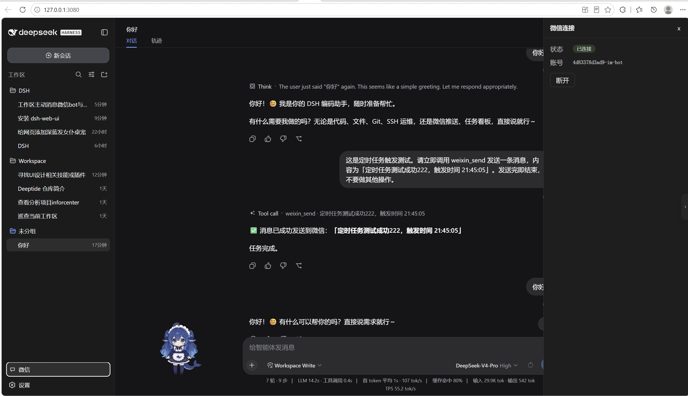
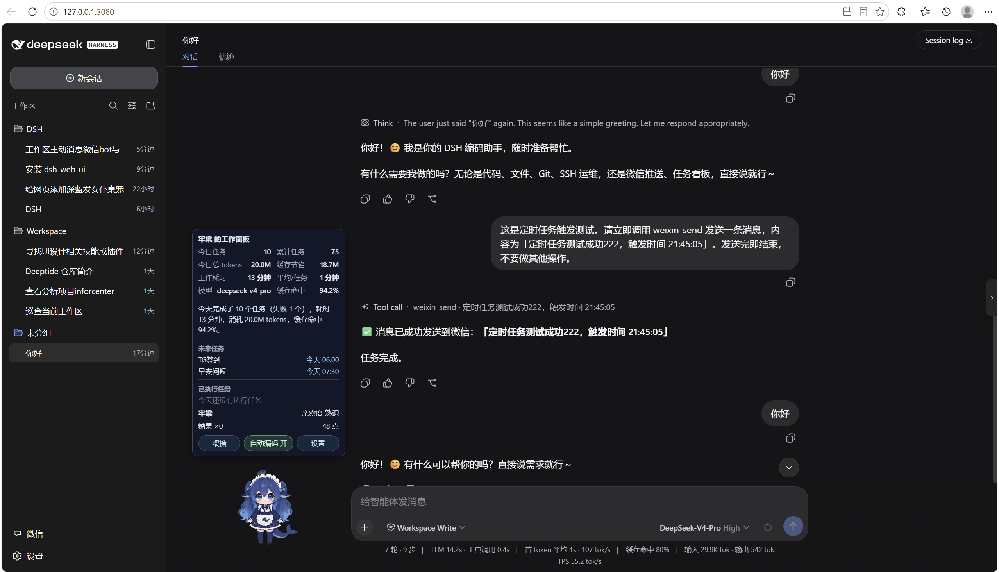
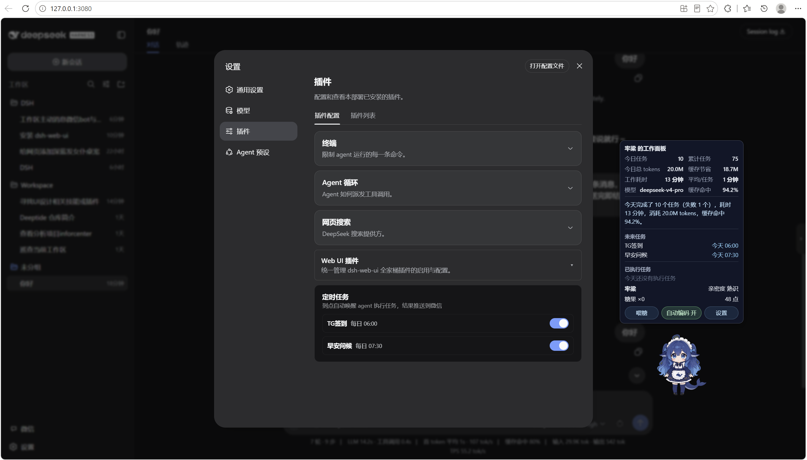

# dsh-wechat-maid · DSH 桌宠与主动功能

dsh-wechat-maid 是一套适用于 DeepSeek Harness（DSH）的插件合集。它提供一只可爱的 deepseek 娘桌宠，并把「主动消息 — 未来任务 — 连接个人微信」串成一条完整的主动能力链：让 DSH 拥有主动汇报的能力，让你能通过桌宠面板检视未来任务的正常运转，并额外收获一份情绪价值。

## 功能插件

### 桌宠（deepseek 娘）

一只常驻界面的 deepseek 娘桌宠，默认名「牢梁」（可在面板里改名）。它会跟随智能体的状态切换动画，点击可摸头互动、投喂糖果可提升亲密度，陪伴度从「初见」一路成长至「心灵之约」。

- **状态动画**：模型状态 → 桌宠动画——`thinking/tool` 时工作、`waiting` 时等待、`done` 时跳跃庆祝、空闲 `idle` 时呼吸待机；
- **摸头互动**：点击 → 气泡反馈 + 亲密度 +1（10s 冷却）；
- **点击变体**：单击=被摸、双击=戳（惊讶）、三下=生气、四下以上=慌张，各有独立逐帧反应动画与气泡；
- **睡眠 / 惊醒**：空闲 60 秒打盹，鼠标或键盘一动即惊醒；
- **喂糖**：悬浮面板「喂糖」→ 消耗 1 颗糖果 + 亲密度 +5（30s 冷却）；
- **糖果经济**：糖果库存上限 20，工作每 3 回合 +1 颗、每 30 分钟 +1 颗；
- **亲密度**：每完成一个回合 +1，四级：初见 → 熟识 → 亲密 → 心灵之约（100 点封顶）；
- **自定义命名 / 拖动 / 隐藏召唤**：改名、拖到任意位置、隐藏后输入框出现「召唤{名字}」按钮，全部持久化；
- **状态气泡 / 主动搭话**：工作时显示当前状态短语，空闲时随机冒一句关怀（约 1.5–4 分钟一次）；
- **工作面板**：今日 / 累计任务、模型、tokens、缓存命中率、今日总结。

### 微信机器人

个人微信通过官方 ClawBot 接口接入。在微信里给机器人发消息即可与 DSH 智能体对话；微信与 Web 共享同一个 agent 会话与记忆（会话 id 固定为 `dsh-weixin-main`，也会出现在 Web 会话列表里）。侧边栏「微信」面板可查看状态、扫码登录、断开。

### 主动消息

agent 工具 `weixin_send` 让智能体随时把消息推到你的微信；内置 cron 定时任务（存于 `~/.dsh/dsh-weixin-tasks.json`），到点自动唤醒智能体干活，完成后把结果推到微信——DSH 由此获得主动能力。

> **注意**：主动推送需最近约 24 小时内收到过至少一条微信消息（微信平台 context_token 限制）；长时间静默后，先在微信里给机器人发条消息即可恢复推送。

### 未来任务面板

桌宠的工作面板直接读取微信插件的定时任务文件，展示「即将执行 / 今日已执行」两组任务，让你一眼确认主动链路在正常运转，不必打开微信或后台日志。

### 自动编码（Auto-coding）

桌宠提供「自动编码」模式，让 vibe coding 更高效：当模型输出结果或向你提问时，自动发一条微信通知——你只需检查成果、再次发起任务，然后就能专心做自己的事，不必一直盯着屏幕等它跑完。

## 安装

DSH 插件通过 `dsh plugin` 命令安装进 **profile**（`dsh web` 对应 `web` profile）。

```sh
# 1. 克隆仓库
git clone https://github.com/skylar-fei/dsh-wechat-maid.git
cd dsh-wechat-maid

# 2. 安装依赖并构建
pnpm install
pnpm -r build

# 3. 把两个插件链接进 web profile
dsh plugin --profile web add link:$(pwd)/packages/dsh-weixin
dsh plugin --profile web add link:$(pwd)/packages/dsh-pet-maid

# 4. 重启 dsh web
dsh web
```

### 验证与卸载

安装成功后重启 `dsh web`：侧边栏出现「微信」入口、界面右下角出现桌宠即生效。卸载用 `dsh plugin --profile web remove ...` 后重启即可。

## 截图

| 截图 1 | 截图 2 |
| --- | --- |
|  |  |

| 截图 3 |
| --- |
|  |

## 来源与版权

| 包 | 说明 | 版权 |
| --- | --- | --- |
| dsh-weixin | 微信个人号接入（官方 ClawBot 接口）+ 主动消息 / 定时任务 | BSD-3-Clause（skylar-fei） |
| dsh-pet-maid | deepseek 娘桌宠 | BSD-3-Clause（skylar-fei） |

deepseek 娘形象来自 B 站 UP 主 [@ZipZipPipe](https://space.bilibili.com/)。

## License

[BSD-3-Clause](LICENSE)
